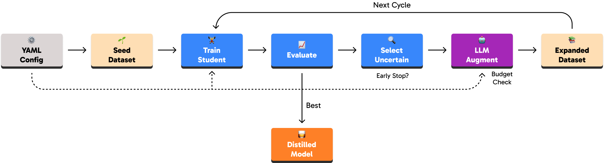

<p align="center">
  
</p>

<p align="center">
  <a href="LICENSE"></a>
  
  <a href="https://docs.astral.sh/uv/"></a>
  <a href="https://docs.astral.sh/ruff/"></a>
  <a href="https://docs.litellm.ai/"></a>
  <a href="https://huggingface.co/"></a>
  <a href="https://makeapullrequest.com"></a>
</p>

<p align="center">
  <em>Iterative knowledge distillation from LLMs to smaller, efficient models</em>
</p>

# Promptillery

Promptillery is a config-driven framework and CLI for distilling knowledge from large language models (LLMs) into compact deployment-ready models. It transforms expensive prompt-based systems into efficient encoder classifiers through an iterative LLM-in-the-loop process.

**Key Features:**

- ⚙️ The **entire workflow is defined via YAML** -- no code required
- 🔄 Runs multiple distillation rounds with **automatic data augmentation**
- 🎯 Uses **intelligent sample selection** based on high-entropy and hard negative samples
- 💰 Includes built-in **token tracking**, **cost estimation**, and **automatic stopping**
- 📊 Run **ablation studies** by simply using list syntax in your config —- all combinations are tested automatically
- ⏱️ Supports **cycle-aware early stopping** with best checkpoint restoration
- 🔀 Handles both **text classification** and **NER** tasks
- 🧩 Built on a **modular trainer architecture** for adding new model types and research methods

## How It Works

Promptillery implements an iterative training loop that distills knowledge from large teacher models (like GPT-5, Claude, ...) into smaller, deployable student models (like BERT, DistilBERT, ...):

<p align="center">
  
</p>

1. **Configure** your experiment with a YAML file specifying teacher, student, dataset, and training parameters
2. **Train** the student model on your seed dataset
3. **Evaluate** performance and identify uncertain predictions
4. **Augment** the dataset using the teacher LLM to generate new examples for difficult cases
5. **Repeat** the cycle until early stopping triggers or budget is exhausted
6. **Export** the final distilled model ready for deployment

## Prerequisites

- **Python 3.10+**
- **[uv](https://github.com/astral-sh/uv)** for dependency management
- **API keys** for your chosen teacher model:
  - OpenAI: `OPENAI_API_KEY`
  - Anthropic: `ANTHROPIC_API_KEY`
  - Or any [LiteLLM-supported provider](https://docs.litellm.ai/docs/providers)
- **Hugging Face token** (optional): `HF_TOKEN` for pushing models to Hub

## Installation

This project uses [uv](https://github.com/astral-sh/uv) for dependency management. After installing `uv`, run:

```bash
uv pip install -e .
```

## Quick Start

Get running in 5 minutes:

```bash
# 1. Clone and install
git clone https://github.com/MIMEDIS/promptillery.git
cd promptillery
uv pip install -e .

# 2. Set your API key
export OPENAI_API_KEY="your-key-here"

# 3. Run an example experiment
uv run promptillery train examples/text_classification_transformers.yaml

# 4. View results
ls -la tweet_sentiment_*/  # Check experiment output
tensorboard --logdir tweet_sentiment_*/logs  # View training metrics
```

## Usage

Create an experiment YAML file (see examples in the `examples/` directory) and invoke the CLI:

```bash
# Run a single experiment
uv run promptillery train examples/text_classification_transformers.yaml

# Run evaluation
uv run promptillery eval examples/text_classification_transformers.yaml

# Run an ablation study (parameter sweep)
uv run promptillery ablation examples/hyperparameter_sweep.yaml

# Run baseline evaluation (zero-shot and few-shot with teacher model)
uv run promptillery baseline -c examples/text_classification_transformers.yaml
```

Experiments are automatically organized into timestamped directories based on the experiment name. For example, an experiment named `tweet_sentiment` will create a directory like `tweet_sentiment_20241205_143022/`.

Training metrics are logged to TensorBoard in the experiment directory. To view them, run:

```bash
tensorboard --logdir {experiment_name}_{timestamp}/logs
```

You can specify a custom base directory for experiments:

```bash
uv run promptillery train examples/sentiment_analysis_experiment.yaml --base-dir ./experiments
```

## Configuration

The configuration schema is defined in `promptillery/config.py`. Several example configurations are available in the `examples/` directory:

**Single Experiments:**

- `text_classification_transformers.yaml` - Text classification with transformer student model (BERT)
- `text_classification_fasttext.yaml` - Text classification with FastText student model
- `early_stopping.yaml` - Training with early stopping enabled
- `budget_stopping.yaml` - Training with budget-based stopping
- `augmentation_without_active_learning_selection.yaml` - Data augmentation without active learning

**Ablation Studies:**

- `hyperparameter_sweep.yaml` - Grid search across learning rates, epochs, and cycles
- `ablation_model_comparison.yaml` - Compare different student models (BERT, DistilBERT, RoBERTa)
- `ablation_teacher_comparison.yaml` - Compare different teacher models (GPT-4o, Claude, etc.)
- `ablation_minimal.yaml` - Simple cycle count test for quick experiments

### Configuration Format

Each experiment configuration must include a required `name` field as the first key, followed by other parameters. Experiment directories are automatically created using this name plus a timestamp.

Prompts use Jinja2 templating syntax and may contain placeholders referencing dataset columns or any configuration parameter. Values from the dataset row take precedence, then `prompt_vars` from the config:

```yaml
name: "tweet_sentiment_analysis"      # Required: experiment name (alphanumeric, dashes, underscores only)
teacher: "openai/gpt-4o-mini"
student: "gerulata/slovakbert"
dataset: "tweet_eval"
metrics:
  - accuracy
  - f1
cycles: 3
output_repo: "org/promptillery-run"
base_output_dir: "."                  # Optional: base directory for experiments (default: current directory)
prompt: |
  Generate new articles on topics where past training was inaccurate, maintaining the same stance with varied wording, examples, or perspectives.
  Given article details:
  - ** Original missclassified article: '{{ text }}'
  - **Original Stance**: '{{ label }}'
  - **Key Reasoning**:
  - Reasoning point 1: {{ reason1 }}
  - Reasoning point 2: {{ reason2 }}
  Your task is to create {{ num_samples }} diverse articles that maintain this stance and leverage similar reasoning.
  # Steps
  1. **Understand Stance and Reasoning**:
  - Evaluate the primary stance of the given article.
  - Comprehend the key reasoning points to ensure logical consistency.

  2. **Variety in Expression**:
  - Use different vocabulary and sentence structures.
  - Introduce new examples or perspectives that align with the stance.
  3. **Maintain Original Requirements**:
  - Keep the stance intact.
  - Ensure each article reflects similar reasoning to the original.
  - Maintain similar length and complexity.
  - Ensure factual consistency where possible.
  4. **Include Key Phrases**:
  - For each article, include key phrases or sentences that parallel the reasoning points.
  # Output Format
  Generate the articles in a dictionary format as follows:
  {
  "article_1": {
      "text": "[Generated article text here]",
      "stance": "{{ label }}"
  },
  "article_2": {
      ...
  }
  }
  # Notes
  - Ensure linguistic diversity between articles while maintaining the core stance and reasoning.
  - Aim to reflect the same logical underpinning that originally led to the stance.
  - Consider potential perspectives that align with the reasoning points for added depth.
prompt_vars:
  num_samples: 2
```

### Automatic Name Modification

By default, Promptillery automatically appends the `student_type` to your experiment name to make outputs more identifiable. For example:

- Config: `name: "sentiment_test"`, `student_type: "transformers"`
- Result: Experiment name becomes `"sentiment_test_transformers"`

This helps distinguish experiments when testing different model types. The modification is case-insensitive and won't duplicate if the type is already in the name.

To disable this behavior:

```yaml
auto_modify_name: false
```

### Early Stopping

Promptillery supports configurable early stopping to prevent overfitting and save computational resources. Early stopping monitors a specified metric and stops training when it stops improving.

```yaml
early_stopping:
  enabled: true              # Enable/disable early stopping
  patience: 2                # Number of cycles to wait without improvement
  metric: "f1"               # Metric to monitor (must be in metrics list)
  mode: "max"                # "max" to maximize metric, "min" to minimize
  min_delta: 0.01            # Minimum change to qualify as improvement
  restore_best: true         # Restore best model when stopping
```

**Configuration Options:**

- `enabled` (bool): Whether to enable early stopping (default: false)
- `patience` (int): Number of cycles to wait for improvement before stopping (default: 2)
- `metric` (str): Metric to monitor - must be in the metrics list (default: "accuracy")
- `mode` ("max" | "min"): Whether to maximize or minimize the metric (default: "max")
- `min_delta` (float): Minimum change required to qualify as improvement (default: 0.0)
- `restore_best` (bool): Whether to restore the best model when early stopping triggers (default: true)

**Examples:**

```yaml
# Stop when F1 score stops improving for 3 cycles
early_stopping:
  enabled: true
  patience: 3
  metric: "f1"
  mode: "max"
  min_delta: 0.005
  
# Stop when loss stops decreasing for 2 cycles  
early_stopping:
  enabled: true
  patience: 2
  metric: "loss"
  mode: "min"
  min_delta: 0.01
```

The early stopping results are included in the final metrics JSON:

```json
{
  "0": {"accuracy": 0.85, "f1": 0.83},
  "1": {"accuracy": 0.87, "f1": 0.85},
  "early_stopping": {
    "triggered": true,
    "best_cycle": 1,
    "best_value": 0.85,
    "metric": "f1",
    "total_cycles": 2
  }
}
```

## Student Model Types

Promptillery supports multiple student model architectures:

### Transformers (`student_type: "transformers"`)

For sequence classification tasks using HuggingFace transformer models:

```yaml
student: "google-bert/bert-base-uncased"
student_type: "transformers"  # This is the default
```

Supported models include BERT, DistilBERT, RoBERTa, ALBERT, ELECTRA, and any HuggingFace model compatible with `AutoModelForSequenceClassification`.

### Transformers NER (`student_type: "transformers_ner"`)

For Named Entity Recognition and token classification tasks:

```yaml
student: "bert-base-uncased"
student_type: "transformers_ner"
```

Uses `AutoModelForTokenClassification` with proper subword token alignment and BIO tagging support.

### FastText (`student_type: "fasttext"`)

Lightweight text classification without deep learning:

```yaml
student: "fasttext"
student_type: "fasttext"
```

**Note:** FastText models cannot be pushed to HuggingFace Hub and are saved as `.bin` files. Use higher learning rates (e.g., 0.5-1.0) compared to transformers.

## Advanced Configuration

### Sampling Configuration

Control dataset sampling for faster experimentation or balanced training:

```yaml
sampling:
  enabled: true
  sample_size: 1000        # Total samples to use
  train_ratio: 0.8         # 80% train, 20% validation
  stratify_column: "label" # Maintain class distribution
  seed: 42                 # Reproducibility
```

### Budget Control

Monitor and limit API costs during augmentation:

```yaml
budget_warning: 10.0   # Warn when estimated cost exceeds $10
budget_stop: true      # Stop experiment when budget exceeded
```

Token usage is tracked per cycle and saved to `token_usage.json` in the experiment directory.

### Dataset Persistence

Control whether dataset snapshots are saved after each cycle:

```yaml
persist_datasets: true   # Default: save dataset_cycle_* directories
persist_datasets: false  # Disable to save disk space
```

### Dataset Configuration

For datasets with non-standard column names or multiple subsets:

```yaml
dataset_config:
  name: "sentiment"        # Dataset subset/config name
  num_classes: 3           # Number of classification labels
  text_field: "sentence"   # Custom text column name
  label_field: "category"  # Custom label column name
```

## Experiment Organization

Promptillery automatically organizes experiments into dedicated directories with the following structure:

```
{experiment_name}_{timestamp}/
├── experiment_config.yaml    # Copy of the experiment configuration
├── training/                 # Model training artifacts
├── logs/                     # TensorBoard logs
├── model/                    # Final trained model
├── metrics.json              # Final evaluation metrics
├── token_usage.json          # API token usage and cost tracking
└── dataset_cycle_*           # Dataset snapshots for each cycle
```

### Directory Naming

- **Format**: `{name}_{timestamp}`
- **Example**: `tweet_sentiment_20241205_143022`
- **Timestamp**: Format is `YYYYMMDD_HHMMSS`
- **Location**: Created in current directory or specified `base_output_dir`

### Configuration

- `name`: Required experiment identifier (alphanumeric, dashes, underscores only)
- `base_output_dir`: Optional base directory (default: current directory)

**Note:** When using `output_repo` to push to a Hugging Face organization (e.g., `org/promptillery-run`), ensure the organization exists and you have the necessary permissions. Otherwise, the push will fail.

For example, a prompt containing `{{ reason1 }}` will first use the `reason1` column
from the dataset if present, otherwise the value defined in `prompt_vars`. Any
field defined in the YAML file such as `{{ teacher }}` or `{{ cycles }}` can also be
referenced.

## Jinja2 Templating

Promptillery uses Jinja2 for prompt templating, which provides powerful templating capabilities beyond simple variable substitution. Key features include:

### Basic Variable Substitution

Use `{{ variable_name }}` to insert values:

```yaml
prompt: |
  Analyze this text: {{ text }}
  The label is: {{ label }}
```

### Conditional Logic

Use `` statements for conditional content:

```yaml
prompt: |
  
  This is a negative example.
  
  This is a positive example.
  
  This is a neutral example.
  
```

### Loops

Use `` loops to iterate over lists:

```yaml
prompt: |
  Consider these examples:
  
  - {{ example }}
  
```

### Filters

Apply filters to transform variables:

```yaml
prompt: |
  Text length: {{ text|length }}
  Uppercase: {{ text|upper }}
  First 100 chars: {{ text|truncate(100) }}
```

### Available Variables

- Dataset columns (e.g., `text`, `label`, `tokens`)
- Configuration parameters (e.g., `teacher`, `student`, `cycles`)
- Values from `prompt_vars` section
- Built-in variables like `num_samples`

## CLI Reference

### Train Command

Run a training experiment:

```bash
promptillery train <config_file> [--base-dir <directory>]
```

**Arguments:**

- `config_file`: Path to experiment YAML configuration file

**Options:**

- `--base-dir`, `-d`: Base directory for experiment outputs (default: current directory)

**Examples:**

```bash
# Run experiment in current directory
promptillery train examples/sentiment_analysis_experiment.yaml

# Run experiment in custom directory
promptillery train examples/sentiment_analysis_experiment.yaml --base-dir ./experiments

# Using uv
uv run promptillery train examples/sentiment_analysis_experiment.yaml
```

### Eval Command

Evaluate a trained model on a dataset split:

```bash
promptillery eval <config_file> [--model-path <path>] [--split <split>] [--base-dir <directory>]
```

**Arguments:**

- `config_file`: Path to experiment YAML configuration file

**Options:**

- `--model-path`, `-m`: Path to trained model checkpoint. If not provided, auto-detects the most recent model matching the experiment name.
- `--split`, `-s`: Dataset split to evaluate on (default: "test")
- `--base-dir`, `-d`: Base directory to search for experiment outputs (default: current directory)

**Examples:**

```bash
# Auto-detect latest model for the experiment
promptillery eval examples/sentiment_analysis_experiment.yaml

# Specify model path explicitly
promptillery eval examples/sentiment_analysis_experiment.yaml --model-path ./tweet_sentiment_20241205_143022/model

# Evaluate on validation split
promptillery eval examples/sentiment_analysis_experiment.yaml --split validation
```

### Ablation Command

Run an ablation study (parameter sweep):

```bash
promptillery ablation <config_file> [--base-dir <directory>]
```

### Baseline Command

Run baseline evaluation with teacher models (zero-shot and few-shot):

```bash
promptillery baseline [OPTIONS]
```

**Options:**

- `--config`, `-c`: Path to experiment config YAML file (reads dataset settings)
- `--dataset`, `-d`: Dataset name (e.g., 'tweet_eval', 'stanfordnlp/imdb')
- `--dataset-config`, `-dc`: Dataset config/subset (e.g., 'sentiment', 'plain_text')
- `--text-column`: Name of the text column (default: "text")
- `--label-column`: Name of the label column (default: "label")
- `--teacher`, `-t`: Teacher model to use (default: openai/gpt-4.1)
- `--mode`, `-m`: Evaluation modes to run (default: zero-shot, few-shot)
- `--num-shots`, `-n`: Number of examples per class for few-shot (default: 2)
- `--max-samples`: Maximum samples to evaluate (useful for testing)
- `--output-dir`, `-o`: Output directory for results (default: baseline_results)
- `--seed`, `-s`: Random seed (default: 42)
- `--concurrency`: Maximum concurrent API calls (default: 10)
- `--verbose`, `-v`: Enable verbose logging

**Examples:**

```bash
# Using an experiment config file (reads dataset and column settings)
promptillery baseline -c examples/text_classification_transformers.yaml

# Using a specific dataset with default columns (text, label)
promptillery baseline -d stanfordnlp/imdb -dc plain_text

# Using a dataset with custom column names
promptillery baseline -d community-datasets/yahoo_answers_topics \
    --text-column question_title --label-column topic

# Run only zero-shot evaluation
promptillery baseline -d stanfordnlp/imdb -dc plain_text -m zero-shot

# Run with a different teacher model
promptillery baseline -d stanfordnlp/imdb -dc plain_text -t openai/gpt-4o-mini
```

**Output:**

Results are saved to the output directory with:

- `baseline_results_{timestamp}.json` - Detailed results with predictions
- `baseline_summary_{timestamp}.csv` - Tabular summary for analysis

The baseline command evaluates the teacher model directly on the classification task, providing reference metrics to compare against your distilled student models.

## Ablation Studies

Promptillery supports ablation studies for systematic hyperparameter testing. Simply use lists for any parameter you want to vary:

### Basic Usage

```yaml
# Instead of:
cycles: 3

# Use a list to test multiple values:
cycles: [1, 3, 5]
```

When multiple parameters have lists, all combinations are tested:

```yaml
name: "hyperparameter_sweep"
cycles: [1, 3, 5]                    # 3 values
augmentation_batch_size: [1, 2, 3]  # 3 values
# Generates 3 × 3 = 9 configurations
```

### Running Ablation Studies

```bash
uv run promptillery ablation examples/hyperparameter_sweep.yaml
```

This will:

1. Generate all parameter combinations
2. Run each configuration independently
3. Save results to individual directories
4. Create an aggregated summary with the best configuration

**Additional Options:**

```bash
# Enable cleanup mode (keeps only best config per augmentation_batch_size group)
uv run promptillery ablation config.yaml --cleanup --cleanup-metric f1

# Disable cleanup to keep all experiment directories
uv run promptillery ablation config.yaml --no-cleanup
```

The cleanup mode significantly reduces disk usage by automatically removing non-best configurations after the ablation completes.

### Examples

**Model Comparison:**

```yaml
name: "model_comparison"
student: ["bert-base-uncased", "roberta-base", "distilbert"]
cycles: 3
```

**Teacher Testing:**

```yaml
name: "teacher_comparison"
teacher: ["gpt-3.5-turbo", "gpt-4o-mini", "claude-3-haiku"]
student: "bert-base-uncased"
```

**Simple Parameter Sweep:**

```yaml
name: "learning_rate_sweep"
learning_rate: [0.001, 0.01, 0.1]
```

### Output Structure

```
base_output_dir/
└── ablation_{name}_{timestamp}/           # Dedicated ablation run folder
    ├── {name}_cycles_1_..._[timestamp]/   # Individual experiment folders
    ├── {name}_cycles_3_..._[timestamp]/
    ├── ...
    ├── all_results.json                   # Raw results
    ├── ablation_summary.csv               # Tabular comparison
    └── ablation_summary.md                # Report with best config
```

### Supported Parameters

Any configuration parameter can be varied:

- `cycles`: Training iterations
- `student`: Student model name
- `teacher`: Teacher model name
- `dataset`: Dataset name
- `dataset_config`: Dataset subset
- `num_labels`: Number of output labels
- `augmentation_batch_size`: Number of synthetic samples per augmentation cycle
- `learning_rate`: Learning rate (default: 2e-5)
- `batch_size`: Training batch size (default: 16)
- `num_train_epochs`: Number of training epochs (default: 3)
- `warmup_steps`: Warmup steps (default: 500)
- `weight_decay`: Weight decay (default: 0.01)

The ablation system is completely generic - it works with any parameter without hardcoded knowledge of specific fields.

### Design Philosophy

The ablation system is implemented as a pure meta-layer:

- **Zero coupling**: The ablation runner doesn't know about specific configuration fields
- **Type-driven**: Uses Pydantic's Union[T, List[T]] types to enable list values
- **Automatic naming**: Configuration names are generated from varying parameters
- **Future-proof**: Any new parameter added to the config automatically supports ablations

## Project Structure

```
promptillery/
├── __init__.py
├── cli.py           # CLI commands (train, eval, ablation, baseline)
├── config.py        # Configuration with Union[T, List[T]] types
├── engine.py        # Core training engine
├── ablation.py      # Generic ablation runner
├── baseline_eval.py # Zero-shot/few-shot baseline evaluation
├── utils.py         # Utilities
├── token_tracker.py # API token usage tracking
└── trainers/        # Model trainers
    ├── base.py
    ├── factory.py
    ├── transformers_trainer.py
    ├── fasttext_trainer.py
    └── ...
```

The `engine` handles dataset loading, fine-tuning, evaluation, and optional data augmentation.

All calls to the teacher model use asynchronous `litellm` completions. Progress is logged via Rich and metrics are written to `metrics.json`.

## Extending Promptillery

Promptillery is designed as an extensible research platform with multiple customization points:

| Extension Point | Method | Use Case |
|-----------------|--------|----------|
| **Sample Selection** | Override `_prepare_sample_context()` | Custom active learning for augmentation |
| **Model Types** | Implement `BaseTrainer` | Add new student architectures |
| **Metrics** | Override trainer `evaluate()` | Domain-specific evaluation |
| **Stopping Criteria** | Subclass `DistillationEngine` | Custom convergence detection |

### Custom Sample Selection for Augmentation

The LLM generates new training samples based on context provided by the sample selection strategy. The default pipeline provides the teacher with:

- **Few-shot examples**: Balanced samples per class
- **High-entropy samples**: Predictions where the model is most uncertain
- **Hard negatives**: Confident misclassifications

To implement custom strategies (e.g., margin-based, clustering, diversity sampling):

```python
from promptillery.engine import DistillationEngine
from promptillery.utils import extract_few_shot_samples

class CustomSelectionEngine(DistillationEngine):
    """Engine with custom sample selection for LLM augmentation."""

    def _prepare_sample_context(self, model):
        ds = self.dataset["train"]
        predictions = self.trainer.get_detailed_predictions(model, split="train")

        # Custom: margin-based (small gap between top-2 predictions)
        margin_samples = self._select_by_margin(ds, predictions, top_k=10)

        # Custom: diversity sampling via clustering
        diverse_samples = self._select_diverse(ds, predictions, n_clusters=5)

        return {
            "few_shot_samples": extract_few_shot_samples(ds, n_per_class=2),
            "margin_samples": margin_samples,
            "diverse_samples": diverse_samples,
            "high_entropy_samples": [],  # Override default
            "hard_negative_samples": [],  # Override default
        }
```

These samples are then available in your prompt template:

```yaml
prompt: |
  The model struggles with these examples:
  
  - "{{ s.text }}" (predicted: {{ s.predicted }}, actual: {{ s.label }})
  

  Generate {{ augmentation_batch_size }} similar examples to improve model performance.
```

### Custom Model Types

Register new student architectures via the trainer factory:

```python
from promptillery.trainers.base import BaseTrainer
from promptillery.trainers.factory import TrainerFactory

class SetFitTrainer(BaseTrainer):
    """Trainer for SetFit few-shot learning models."""

    def train(self): ...
    def evaluate(self, model, split="test"): ...
    def get_detailed_predictions(self, model, split="train"): ...

TrainerFactory.register_trainer("setfit", SetFitTrainer)
```

```yaml
student_type: "setfit"
```

This modular architecture lets researchers experiment with new distillation methods, active learning strategies, or model architectures while leveraging the existing infrastructure for ablation studies, budget tracking, and experiment management.

## License

This project is licensed under the MIT License - see the [LICENSE](LICENSE) file for details.
